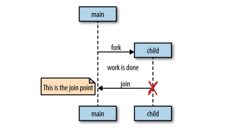
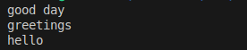

# GO ROUTINES 


## Intro

Goroutines : subroutine functions that can't be interrupted
- They have multiple points for supsension/re-entry.
- Go runtime observes their runtime behavior and automatically suspends them when they block and then resumes them when they become unblocked.
- Go follows a model of concurrency called "fork-join model" :
    -> "fork" : at any point in the program it can split off a branch if execution to be run concurrently whith its parent. 
    -> "join" : at some point in the future the conccurent branhces of execution we'll join back together a the "joint point".
    


## First example 

We can write go routines different ways :

```go
    func main(){
        go SayHello()
        //rest of the code ...
    } 

    func SayHello(){
        fmt.Println("Hello")
    }
```

or by using an anonymous function :
```go
    func main(){
        go func(){
            fmt.Println("Hello")
        }()
        // rest of the code ...
    }
```

or we can assign the function to a variable and call the anonymous function this way :
```go
    sayHello := func(){
        fmt.println("Hello")
    }
    go SayHello()
    // rest of the code ...
```

In this example SayHello()'ll be run on its own goroutine while the rest of the program continues executing.
Here, there's no joint point so the SayHello goroutine'll simply exit at some point in the future and the rest of the program'll have already continued executing :
- It's undertermined wether SayHello()'ll ever be run at all.
- The goroutine'll be created and scheduled with Go's runtime to execute but it may not get a chance to run before the main goroutine exits.
- In this case the programm'll finish executing before the goroutine hosting the call to SayHello ever started. 
- We could out a time.Sleep after the goroutine but it doesn't create a join point (only a race condition).


### Creating a join point

We need to synchronize the main and the SayHello goroutines : "synch.WaitGroup"
```go
    var wg synch.WaitGroup
    SayHello := func (){
        defer wg.Done()
        fmt.Println("Hello")
    }
    wg.Add(1)
    go SayHello()
    wg.Wait() //this is the join point 
```
    -> The gorouitne is blocked until the goroutine hosting SayHello() terminates.

Closures close around the lexical scope they're created in (capturing variables)
- If we run a closure in a goroutine does the closure operate on a copy of these variables ? or the original reference ?
```go
    var wg synch.WaitGroup
    salutation := "hello"
    wg.Add(1)
    go func(){
        defer wg.Done()
        salutation = "Welcome"
    }()
    wg.Wait()
    fmt.Println(salutation)
```
    -> Goroutines execute within the same address space they were created in so our program prints "Welcome".

```go
    var wg synch.WaitGroup
    for _, salutation := range []string {"Hello", "Greetings", "Good day"}{
        wd.Add(1)
        go func(){
            defer wg.Done()
            fmt.Println(salutation)
        }()
    }
    wg.Wait()
```
    -> Before the 22 version Go update the result was :
    
        -> Each iteration of the loop used the same variable which was updated in each iteration.
        -> This led to unexpected behavior in goroutines : they might all end up referring to the final value of the loope variable.
    -> After the update the result is :
    
        -> Each iteration of a for loop that declares variables uses a new variable for each iteration.
        -> This new behavior applies to "for", "for range" and "if" statement assignment loops.
        -> This change makes the following code behave as most developers would intuitively expect:
        
```go
            for _, salutation := range []string{"Hello", "Greetings", "Good day"}{
                go func(){
                    fmt.Println(salutation)
                }()
            }
```

            -> Now each goroutine captures a different "salutation" value corresponding to the iteration in which it was launched.
            -> While this change makes many concurrent patterns in Go safer and more intuitive it's still considered to explicitly pass loop variables to goroutines
            -> It makes the intent clear and ensures cimpatibility with older Go versions

```go
                for _, salutaiton := range []string {"Hello", "Greetings", "Good day"}{
                    go func(s string){
                        fmt.Println(s)
                    }(salutation)
                }
 ``` 
Because goroutines operate whithin the same address space as each other and just host functions : utilizing them is a natural extension to writing non-concurrent code.
Go compiler takes care of pinning variables in memory so that the goroutines don't accidently access freed memory :
- Allows developers to focus on their space problems instead of memory managment. 
- Since multiple goroutines can operate against the same address space we still need to worry about synchronization.
    -> Synchronize access to the shared memory the goroutines access.
    -> Use CSP primitives (Communicating Sequencial Processes) to share memory by communication.
        -> Formal language for describing patterns of interaction in concurrent systems : components communicate with each other only through message passing whithout sharing memomry.