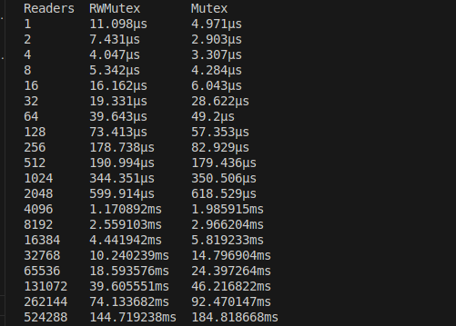
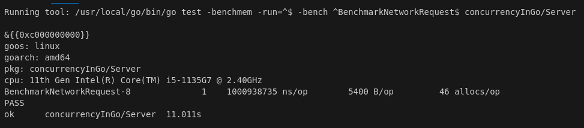

# GO ROUTINES 


## Intro

Goroutines : subroutine functions that can't be interrupted
- They have multiple points for supsension/re-entry.
- Go runtime observes their runtime behavior and automatically suspends them when they block and then resumes them when they become unblocked.
- Go follows a model of concurrency called "fork-join model" :
    - "fork" : at any point in the program it can split off a branch if execution to be run concurrently whith its parent. 
    - "join" : at some point in the future the conccurent branhces of execution we'll join back together a the "joint point".

    


## First example 

We can write go routines different ways :

```go
    func main(){
        go SayHello()
        //rest of the code ...
    } 

    func SayHello(){
        fmt.Println("Hello")
    }
```

or by using an anonymous function :

```go
    func main(){
        go func(){
            fmt.Println("Hello")
        }()
        // rest of the code ...
    }
```

or we can assign the function to a variable and call the anonymous function this way :

```go
    sayHello := func(){
        fmt.println("Hello")
    }
    go SayHello()
    // rest of the code ...
```

In this example SayHello()'ll be run on its own goroutine while the rest of the program continues executing.
Here, there's no joint point so the SayHello goroutine'll simply exit at some point in the future and the rest of the program'll have already continued executing :
- It's undertermined wether SayHello()'ll ever be run at all.
- The goroutine'll be created and scheduled with Go's runtime to execute but it may not get a chance to run before the main goroutine exits.
- In this case the programm'll finish executing before the goroutine hosting the call to SayHello ever started. 
- We could out a time.Sleep after the goroutine but it doesn't create a join point (only a race condition).


### Creating a join point

We need to synchronize the main and the SayHello goroutines : "synch.WaitGroup"

```go
    var wg synch.WaitGroup
    SayHello := func (){
        defer wg.Done()
        fmt.Println("Hello")
    }
    wg.Add(1)
    go SayHello()
    wg.Wait() //this is the join point 
```

- The gorouitne is blocked until the goroutine hosting SayHello() terminates.

Closures close around the lexical scope they're created in (capturing variables)
- If we run a closure in a goroutine does the closure operate on a copy of these variables ? or the original reference ?

```go
    var wg synch.WaitGroup
    salutation := "hello"
    wg.Add(1)
    go func(){
        defer wg.Done()
        salutation = "Welcome" // the goroutine is modifying the value of the variable salutation
    }()
    wg.Wait()
    fmt.Println(salutation)
```

- Goroutines execute within the same address space they were created in so our program prints "Welcome".

```go
    var wg synch.WaitGroup
    for _, salutation := range []string {"Hello", "Greetings", "Good day"}{
        wd.Add(1)
        go func(){
            defer wg.Done()
            fmt.Println(salutation) // loop variable created by ranging over a string slice
        }()
    }
    wg.Wait()
```

- Before the 22 version Go update the result was :

    

- Each iteration of the loop used the same variable which was updated in each iteration.
- This led to unexpected behavior in goroutines : they might all end up referring to the final value of the loop variable.
- After the update the result is :

    

- Each iteration of a for loop that declares variables uses a new variable for each iteration.
- This new behavior applies to "for", "for range" and "if" statement assignment loops.
- This change makes the following code behave as most developers would intuitively expect:
        
```go
func main(){
    for _, salutation := range []string{"Hello", "Greetings", "Good day"}{
        go func(){
            fmt.Println(salutation)
        }()
    }
}
```

- Now each goroutine captures a different "salutation" value corresponding to the iteration in which it was launched.
- While this change makes many concurrent patterns in Go safer and more intuitive it's still considered to explicitly pass loop variables to goroutines
- It makes the intent clear and ensures cimpatibility with older Go versions


```go
func main(){
    for _, salutation := range []string {"Hello", "Greetings", "Good day"}{
    go func(s string){
        fmt.Println(s)
    }(salutation)
    }
}
 ``` 
 
Because goroutines operate whithin the same address space as each other and just host functions : utilizing them is a natural extension to writing non-concurrent code.
Go compiler takes care of pinning variables in memory so that the goroutines don't accidently access freed memory :
- Allows developers to focus on their space problems instead of memory managment. 
- Since multiple goroutines can operate against the same address space we still need to worry about synchronization.
    - Synchronize access to the shared memory the goroutines access.
    - Use CSP primitives (Communicating Sequencial Processes) to share memory by communication.
        - Formal language for describing patterns of interaction in concurrent systems : components communicate with each other only through message passing whithout sharing memory.
Another benefit of goroutines : extraordinary lightweight (a few Kb/goroutine).

Goroutines are not garbage collected with the runtime"s ability to introspect upon itself and measure the amount of memory allocated before and after goroutine creation :

```go
func main(){
    memConsumed := func() unint64{
        runtime.GC()
        var s runtime.Memstats
        runtime.ReadMemStats(&s)
        return s.Sys
    }

    var c <-chan interface{}
    var wg synch.WaitGroup
    noop := func() {wg.Done(); <-c} // 1

    cins numGoroutines = 1e4 // 2
    wg.Add(numGoroutines)
    before := memConsumed() // 3 
    for i := numGoroutines; i > 0; i --{
        go noop()
    }
    wg.Wait()
    after := memConsumed() // 4
    fmt.Printf("%.3fkb", float64(after-before)/numGoroutines/1000)
}
```

- 1 : We require goroutines that'll never exit so we can keep them in memory for measurement.
- 2 : We define the number of goroutines to create (1e4 = 10 000).
- 3 : We measure the amount of memory consumed before and after creating our goroutines.
- The result we get is arround 2.600kb


## Sync package 

Contains the concurrency primitives that are most useful for lowlevel memory access synchronization.

### WaitGroup

WaitGroup is a great way to wait for a set of conccurent operations to complete when :
- We don't care about the result of the concurrent operations.
- We have other means to collect their result. 
    - If not : We'd better use Channels and select a statement.

Basic example of using WaitGroup to wait for goroutines to complete :

```go
    func main(){
        var wg sync.WaitGroup 

        wg.Add(1) // 1
        go func(){
            defer wg.Done() // 2
            fmt.Println("1st goroutine sleeping...")
            time.Sleep(1)
        }()

        wg.Add(1) // 1
        go func() {
            defer wg.Done() // 2
            fmt.Prinln("2cd goroutine sleeping...")
            time.Sleep(2)
        }()
        wg.wait() // 3
        fmt.Println("All goroutines complete.")
    }
```

- 1 : We call Add with an argument of 1 to indicate that one goroutine is beginning.
- 2 : We call Done using the defer keyword to ensure that before we exit the goroutine's closure we indicate to the WaitGroup that we've exited.
- 3 : We call Wait which blocks the main goroutine until all goroutines have indicated they have exited. 
- We get this result :


- Go'll send you 2 error messages saying that sleeping for 1 nanoseconds is probably a bug because most operating systems don't provide precise timing down to the nanosecond level (the typical time is in the range of microseconds or milliseconds).
    - 1 nanosecond sleep'll almost expire immediatly and may not give the goroutine scheduler enough time to switch contexts.

We can think of WaitGroup like a concurrent-safe counter : 
- Calls to Add to increment the counter by the integer passed in.
- Calls Done to decrement the counter by 1.
- Calls Wait to block until the counter attains 0.

It's customary to couple calls to Add as closely as possible to the goroutines they're helping to track but sometimes we'll find Add called to track a group of goroutines all at once:

```go
func main(){
    hello := func(wg *sync.WaitGroup, id int) {
	    defer wg.Done()
	    fmt.Printf("Hello from %v\n", id)
    }
	const numGreeeters = 5
	wg.Add(numGreeeters)
	for i := 0; i < numGreeeters; i++ {
		go hello(&wg, i+1)
	}
	wg.Wait()
}
```
- We'll get this result :


- But if we run it several times we won't get the same order because it's the principle of concurrency :
- Go's runtime scheduler decides when to execute each goroutine based on factors like CPU availability, the state of the other goroutines and the internal scheduling algorithm.
- There's no garuantee that the goroutines'll execute in the order they were created.


### Mutex & RWMutex


#### Mutex

Mutex : Mutual Exclusion, it's a way to guard critical sections of our program (areas that require exclusive acces to a sharde resource).
- Provides a conccurent-safe way to express exclusive acces to these sharred resources.
- Shares memory by creating a convention developers have to follow to synchronyze access to the memory.
- We're responsible for coordinationg access to this memory by guarding access to it with a Mutex.

Example of 2 goroutines attempting to increment & decrement a common value, they use Mutex to synchronize access :

```go
    func main(){
        var count int 
        var lock sync.Mutex

        increment := func(){
            lock.Lock() // 1
            defer lock.Unlock() // 2
            count ++
            fmt.Printf("Incrementing: %d\n", count)
        }

        decrement := func(){
            lock.Lock() // 1
            defer lock.Unlock() // 2
            count --
            fmt.Printf("Decrementing: %d\n", count)
        }

        var arithmectic sync.WaitGroup
        for i := 0; i <= 5; i ++{
            arithmetic.Add(1)
            go func(){
                defer arithmetic.Done()
                increment()
            }()
        }

        for i := 0; i <= 5; i --{
            arithmetic.Add(1)
            go func(){
                defer arithmetic.Done()
                decrement()
            }()
        }
        arithmetic.Wait()
        fmt.Println("Arithmetic complete.")
    }
```

we could refactor the for loop :

``` go
    func main(){
        var count int
        var lock sync.Mutex
        var arithmetic sync.WaitGroup

        increment := func(){
            lock.Lock() // 1
            defer lock.Unlock() // 2
            count++
            fmt.Printf("Incrementing: %d\n", count)
        }

        decrement := func(){
            lock.Lock() // 1
            defer lock.Unlock() // 2
            count --
            fmt.Printf("Decrementing: %d\n", count)
        }

        for i := 0; i <= 5; i ++{
            arithmetic.Add(1)
            go func(){
                defer arithmetic.Done()
                increment()
            }()
            arithmetic.Add(1)
            go func(){
                defer arithmetic.Done()
                decrement()
            }()
        }
        arithmetic.Wait()
        fmt.Println("Arithmetic complete.")
    }
```
- 1 : We request exclusive use of the critical section (the count variable) guarded by a Mutex lock : lock.Lock()
- 2 : We indicate that we're done with the critical section lock is guarding : defer lock.Unlock()
    - We always call Unlock whithin the defer statement : ensures that the call always happen even when panicking.
    - Failing to do so would probably cause our program to deadlock.
    - Deadlock : when >= 2 processes are each waiting for the other to release resources or perform actions, causing all of them to remain blocked indefinitly. 
- We get this kind of result (because it varies each time we run the program) :


#### RWMutex 

RWMutex : conceptually the same thing as Mutex, guards access to memory but gives us a little bit more control over the memory.
We can request a lock for reading : we'll be granted access unless the lock is beeing held for writing.
- An arbitrary number of readers can hold a reader lock so long as nothing else is holding a writer lock.

Example showing that a producer is less active than the numerous consumers the code creates :

```go
    func main(){
        var wg sync.WaitGroup

        producer := func(wg *sync.WaitGroup, l sync.Locker){ // 1
            defer wg.Done()
            for i:= 5; i > 0; i --{
                l.Lock()
                l.Unlock()
                time.Sleep(1) // 2
            }
        }

        observer := func(wg *sync.WaitGroup, l sync.Locker){
            defer wg.Done()
            l.Lock()
            defer l.Unlock()
        }

        test := func(count int, mutex, rwMutex sync.Locker) time.Duration{
            wg.Add(count+1)
            beginTestTime := time.Now()
            go producer(&wg, Mutex)
            for i := count; i > 0; i --{
                go observer(&wg, rwMutex)
            } 
            wg.Wait()
            return time.Since(beginTestTime)
        }
        
        tw := tabwriter.NewWriter(os.Stdout, 0, 1, 2, ' ', 0)
        defer tw.Flush()

        var m sync.RWMutex 
        fmt.Fprintf(tw, "Readers\tRWMutex\tMutex\n")
        for i := 0; i < 20; i++{
            count := int(math.Pow(2, float64(i)))
            fmt.Fprintf(
                tw,
                "%d\t%v\t%v\n",
                count,
                test(count, &m, m.RLocker()),
                test(count, &m, &m),
            )
        }
    }
```

- 1 : The producer function's 2cd parameter is of the type sync.Locker: has 2 methods (Lock and Unlock) that Mutex & RWMutex satisfy.
- 2 : We make the producer sleep for 1 nanosecond to make it less active than the observers goroutines.
- We get this result :



- What we need to remember is that :
    - RWMutex provides better performances read-heavy scenarios : allows multiple readers to acces the shared resource simultaneously, reducing contention.
    - Mutex is simpler and slightly faster in low-contention cases.


### Cond

Cond describes a "rendez-vous point for goroutines waiting for/announcing the occurence of an event".
- Event : any arbitrary signal between >=2 goroutines that carries no information other than the fact that it has occured.
- In most cases we'll want to wait for these signals before continuing execution on a goroutine.
whithout the Cond type : one naïve way of doing that is to use an infinite loop :

```go
    for conditionTrue() == false {

    }
```

- This would consume all cylces of one core : to fix that we'd need to use time.Sleep :

```go
    for conditionTrue() == false {
        time.Sleep(1*time.Millisecond)
    }
```

- This is better but still inefficient, we'd have to figure out how long to sleep for:
    - Too long : artificially degrading performances
    - Too short : unnecessary consuming too much CPU time
- It'd be better if the goroutine could efficiently sleep until it was signaled to wake and check its conditions : that's what Cond does for us

```go
    func main(){    
        c := sync.NewCond(&sync.Mutex) // 1
        c.L.Lock() // 2
        for conditionTrue() == false {
            c.Wait() // 3
        }
        c.L.Unlock() // 4
    }
```

- 1 : We initiate a new Cond that takes in a type that satsfy the sync.Locker interface (Mutex).
    - Allows the Cond type to facilite coordination with other goroutines in a concurrent-safe way.
- 2 : We lock the Locker for this condition : necessary because the call to Wait automatically calls Unlock on the Locker when entered.
- 3 : We wait to be notified that the condition has occured : blocking call (the goroutine'll be suspended).
- 4 : We unlock the Locker for this condition : necessary because when the call to Wait exits it calls Lock on the Locker for the condition.


#### Signal

Example to show both sides of the equation:
- A goroutine that's waiting for a signal 
- A goroutine that's sending the signal
We have a queue of fixed length 2 & 10 items we want to push onto the queue
- We want to enqueue items as soon as ther is a room : we want to be notified as soon as ther's room in the queue.

```go
    func main(){
        a := sync.NewCond(&sync.Mutex{}) // 1
        queue := make([]interface{}, 0, 10) // 2

        removeFromQueue := func(delay time.Duration) {
            time.Sleep(delay)
            a.L.Lock() // 8
            queue = queue[1:] // 9
            fmt.Println("Removed from queue")
            a.L.Unlock() // 10
            a.Signal() // 11
        }

        for i := 0; i < 10; i++ {
            a.L.Lock() // 3
            for len(queue) == 2 { // 4
                a.Wait() // 5
            }
            fmt.Println("Adding to queue")
            queue = append(queue, struct{}{})
            go removeFromQueue(1 * time.Second) // 6
            a.L.Unlock() // 7
        }
    }
```

- 1 : We create our condition using a standard sync.Mutex as the Locker.
- 2 : We create a slice with a length of 0 and initiate it with a capacity of 10.
- 3 : We enter the critical section for the condition by calling Lock on the condition's Locker.
- 4 : We check the length of the queue in a loop : 
    - important because a signal on the condition doesn't necessarily mean that what we've been waiting for has occurred only that something's occurred. 
- 5 : We call Wait : will suspend the main goroutine until a signal on the condition's been sent.
- 6 : We create a new goroutine that'll dequeue an element after 1 second.
- 7 : We exit the condition's critical section since we've successfully enqueued an item.
- 8 : We enter the critical section once again for the condition so we can modify data pertninent to the condition.
- 9 : We simulate dequeuing an item by reassigning the head of the slice to the 2cd item.
- 10 : We exit the condition's critical section since we've successfully dequeued an item.
- 11 : We let a goroutine waiting on the condition know that somethinf has occurred. 
- We get this result :


- The program successfully add 10 items to the queue and exits before it has a chance to dequeue the last 2 items 
- It always wait until at least 1 item is dequeued before enqueing another one.
- Signal : 1 of the 2 methods that Cond provides for notifying goroutines blocked on Wait call that condtion has been triggered (The other one is Broadcast).Internally the runtimes maintains a FIFO list of goroutines waiting to be signaled.
    - Signal finds the goroutine that's been waiting the longest and notifies that.
    - FIFO list : First-in First-out, it's a data struct where the first element added to the list is also the first one to be removed. 
- Broadcast : sends a signal to all goroutines that are waiting.
    - Broadcast is more interesting as it provides a way to communicate with multiple goroutines at once.
    - We could do the same thing with Signal with channels but Broadcast is way more efficient.


#### Broadcast 

Lets imagine we're creating a GUI application with a button on it, we want to register an arbitrary number of functions that'll run when that button is clicked on. Con is perfect for it because we can use its Broadcast method to notify all registered handlers :

 ```go
    func main(){
        type Button struct { // 1
            Clicked *sync.Cond
        }
        button := Button{Clicked: sync.NewCond(&sync.Mutex{})}

        subscribe := func(d *sync.Cond, fn func()){ // 2
             var goroutineRunning sync.WaitGroup
            goroutineRunning.Add(1)
            go func(){
                goroutineRunning.Done()
                d.L.Lock()
                defer d.L.Unlock()
                d.Wait()
                fn()
            }()
            goroutineRunning.Wait()
        }

        var clickRegistered sync.WaitGroup // 3
        clickRegistered.Add(3)
        subscribe(button.Clicked, func(){ // 4
            fmt.Println("Maximizing window")
            clickRegistered.Done()
        })
        subscribe(button.Clcked, func(){ // 5
            fmt.Println("Displaying annoying dialog box")
            clickRegistered.Done()
        })
        subscribe(button.Click, func(){ // 6
            mt.Println("Mouse clicked")
            lickRegistered.Done()
        })
        button.Clicked.Broadcast() // 7
        clickRegistered.Wait()
    }
```

- 1 : We define a type Button that contains the Condition Clicked.
- 2 : We define a convenience function that'll allow us to register functions to handle signals from a condition. 
    - Each handler is run on its own goroutine.
    - Subscribe'll not exit until that goroutine is confirmed to be running.
- 3 : We set a handler for when the mouse button is raised.
    - In turn it calls Broadcast on the Clicked Cond to let all handlers know that the mouse button has been clicked.
- 4 : We create WaitGroup to ensure our program doesn't exit before our writes to Stdout occur.
- 5 : We register a handler that simulates maximizing the button's window when the button is clicked.
- 6 : We register a handler that simulates displaying a dialog box when the mouse is clicked .
- 7 : We simulate a user raising the mouse button from having having clicked the application's button.
- We get this result :


- With 1 call to broadcast on the Clicked Cond all 3 handlers are run.
    - Without the clickRegistered WaitGroup we could call button.Clicked.Broadcast multiple times and each time all 3 handlers would be invoked.
    - This is something channel's can't do easily and one of the main reasons to use Cond type.
- Like most of the things in the sync Package the usage of Cond works best when constrained to a tight scope or exposed to a broader scope taht encapsulates it.


### Once

Sync.Once is a type that utilizes sync primitives internally to ensure that only one call to DO ever calls the function passed in, even on different goroutines.
- We wrap the call to increment in a sync.Once Do method.
The ability to call a function exactly once is a strange thing to encapsulate and put into the standard package but the need for this pattern comes up rather frequently.

```go
    func main(){
        var count int
        increment := func(){
            count ++
        }

        var once sync.Once
        var increments sync.WaitGroup
        increments.Add(100)
        for i := 0; i < 100; i ++{
            go func(){
                defer increments.Done()
                once.Do(increment)
            }()
        }
        increments.Wait()
        fmt.Printf("Count is %d\n", count)
    }
```

- It's tempting to say that the result'll be "Count is 100" but the sync.Once variable wraps the call to increment within the Do method of once.
- The result'll be "Count is 1".

```go
    func main(){
        var count int
        increment := func(){count++}
        decrement := func(){count--}

        var once sync.Once
        once.Do(increment)
        once.Do(decrement)

        fmt.Printf("Count: %d\n", count)
    }
```

- The result is "Count: 1"
    - sync.Once only counts the number of times Do is called not how many times unique functions passed into Do are called.

```go
    func main(){
        var onceA, onceB syn.Once
        var initB func()
        initA := func(){onceB.Do(initB)}
        initB := func(){onceA.Do(initA)} //1
        inceA.Do(initA) // 2
    }
```

- 1 : The call to initB can't proceed until the onceA.Do(initA) call returns.
- 2 : The program'll deadlock because the call to initB won't proceed until the call to onceA.Do(initA) exits.
- This might seem counter-intuitive : we're using sync.Once as intended to guard against multiple initialization
    - But the only thing sync.Once guarantees is that our functions are only called once.
    - Sometimes it's done by deadlocking our program exposing the flaws on our logic.


### Pool

It's a concurrent-safe implementation of the object pool pattern.
It's a way to create and make available a fixed number (pool) of things to use.
It's usually used to constrain the creation of things that are expensive (database connections) so that only a fixed number of them are ever created; but an indeterminate number of operations can still access to thes things.
- This data type can be safely used by multiple goroutines 
Pool's primary interface is its Get method :
- When called Get'll first check whether there are anu available instances within the pool to return to the caller.
- If not calls its New member variable to create a new one.
- When finished caller call Put to place the instance they were woking with back in the pool for use by other processes.

```go
    func main(){
        myPool := &sync.Pool{ // 1
            New: func() interface{}{
                fmt.Println("Creating new instance.")
                return struct{}{}
            },
        }

        myPool.Get() // 2
        instance := myPool.Get() // 2
        myPool.Put(instance) // 3
        myPool.Get() // 4
    }
```

- 1 : We create the variable myPool
- 2 : We call get on the pool : these calls'll invoke the New functio defined on the poo since instances haven't yet been instantiated.
- 3 : We put an instance previously retrieved back in the pool : it increases the available number of instances to 1.
- 4 : When this call is executed we'll reuse the instance previously allocated and put it back in the pool.
    - The New function'll not be invoked.
- We get this result :


So why use a pool and not just instanttiate objects .
- Go has a garbage collector so instantiated objects'll be automatically cleaned up.

```go
    func main(){
        var numCalcsCreated int
        calcPool := &sync.Pool {
            New: func() interface{}{
                numCalcsCreated += 1
                mem := make([]byte, 1024)
                return &mem // 1 
            },
        }

        // Seed the pool with 4kb
        calcPool.Put(calcPool.New())
        calcPool.Put(calcPool.New())
        calcPool.Put(calcPool.New())
        calcPool.Put(calcPool.New())

        const numWorkers = 1024*1024
        var wg sync.WaitGroup
        wg.Add(numWorkers)
        for i := numwWorkers; i > 0; i --{
            go func() {
                defer wg.Done()
                mem := calcPool.Get().(*[]byte) // 2
                defer calcPool.Put(mem)
            }()
        }
        wg.Wait()
        fmt.Printf("%d calculators were created", numCalcsCreated)
    }
```

- 1 : We're storing the address of the slice of bytes.
- 2 : We're asserting the type is a pointer to a slice of bytes.
- We get the result "8 calculators were created."
    - If we'd have run it whithout a sync.Pool the result'd be non deterministic.

Pool is useful for warming a cache of pre-allocated objects for operations that must run as quickly as possible.
- Instead of trying to guard the host machine's memory by constaining the jumber of objects created we're trying to guard consumers' time by front-loading the time it takes to get a refence to another object.
- It's very common when writing network servers that attempt to respond to requests as quickly as possible.
- Let's create a function that simulates creating a connection to a service in the server.go file (we'll make this connection take a long time) : 

```go 
    func connectToService() interface{}{
        time.Sleep(1*time.Second)
        return struct{}{}
    }

```

- Next let's how performant a network service would be iffor every request we started a new connection to the service.
- We'll write a network handler that opens a connection to another sevice for every connection the network handler accepts.
    - We'll only allow one connection at a time (still in the server.go file) :

```go
    func startNetworkDaemon() *sync.WaitGroup{
        var wg.WaitGroup
        wg.Add(1)
        go fun() {
            server, err := net.Listen("tcp"), "localhost: 8080")
            if err != nil {
                log.Fatalf("cannot listen: %v", err)
            }
            defer server.Close()
            wg.Done()

            for {
                conn, err := server.Accept()
                if err != nil {
                    log.Printf("Cannot accept connection: %v", err)
                    continue 
                }
                connectToService()
                fmt.Fprintln(conn, "")
                conn.Close()
            }
        }()
        return wg
    }
```

- Now let's benchmark this (in the server_test.go) :

```go 
    func init(){
        daemonStarted := startNetworkDaemon()
        daemonStarted.Wait()
    }			ConnectToService()

    func BenchmarkNetworkRequest(b *testing.B){
        for i := 0; i < b.N; i ++{
            conn, err := net.Dial("tcp", "localhost:8080")
            if err != nil {
                b.Fatlaf("Cannot dial host: %v", err)
            }
            if _, err := io.ReadAll(conn); err != nil {
                b.Fatalf("Cannot read: %v", err)
            }
            conn.Close()
        }
    }
```

- lets enter this command in the terminal (in the server_test.go directory) : go test -benchtime=10s -bench=.


- we can also just click on "run benchmark" above the BenchmarckNetworkRequest function :


- we get this result :



- We get like 1e9 ns/op ( more or less 1s/operation): it's the average time taken to complete one iteration of the benchmark (nanosecond/operation)
- Let's see if we can improve it by using a sync.Pool to host connections to our fictious service :

```go 
    func warmServiceConnCache() *sync.Pool {
        p := &sync.Pool{
            New: connectToService,
        }
        for i:= 0; i < 10; i++{
            p.Put(p.New())
        }
        return p
    }

    func StartNetworkDaemon() *sync.WaitGroup {
        var wg sync.WaitGroup
        wg.Add(1)
        go func(){
            connPool := warmServiceConnCache()

            server, ee := net.Listen("tcp", "loclahost:8080")
            if err != nil {
                log.Fatalf("Cannot listen: %v", err)
            }
            defer server.Close()
            wg.Done()

            for {
                conn, err := server.Accept()
                if err != nil {
                    log.printf("Cannot accept connection: %v", err)
                    continue
                }
                svcConn := connPool.Get()
                fmt.Fprintln(conn, "")
                connPool.Put(svcConn)
                conn.Close()
            }
        }()
        return &wg
    }
```
- We enter the same command as before : go test -bechtime=10s -bench=.


- We get like 8.6e5 ns/op so its approximately 1e3 (1000x) times faster than previously.
    - Utilizing this pattern when working with things that are expensive to create can drastically improve response time.
- The object pool design pattern is best used either when we have concurrent processes that requires objects (but disposed of them very rapidly after instantiation) or when construction of these objects could negatively impact memory.
- There is 1 thing to be wary of when determinig whether or not we should utilize a Pool:
    - If the code that utilizes Pool requires things that are not homogenous we may spend more time converting what we retrieved from the Pool than it would have taken just to instantiate it in the first place.
    - If our program requires slices of random and viariable length : a Pool isn't going to help us much (the probability of receiving a slice the length we requier is low).
- When working with Pool we need to keep the following points in mind :
    - When instantiating sync.Pool give it a New member variable that is thread-safe when called.
    - When receiving an instance from Get don't make assumptions regarding the state of the object we receive back.
    - Make sure to call Put when we're finished with the object we pulled out of the Pool (otherwise the Pool is useless). It's usually done with Defer.
    - Objects in the Pool must be uniform in makeup.


## Channels

Channels are 1 of the synchronization primitives in Go derived from Hoare's CSP (Communicating Sequential Processes).
- CSP : model for describing patterns of interaction in concurrent systems.
Channels can be used to synchronize access of the memory but their primary use is to communicate informations between goroutines.
- They are extremely usefull in programs of any size because of their ability to be composed together.
When using channels we'll pass a value into a chan variable and somewhere else in our program read it off the channel.
- The disparate parts of our program don't require knowledge of each other only a reference to the same place in memory where the channel resides.
- This can be done by passing references of channels around our program.

Creating a channel is very simple :
- We can create a channel with the ":=" operator but we'd need to often declare channels so it's usefull to see the 2 slipt into individual steps :

```go
    var dataStream chan interface{} // 1
    dataStream = make(chan interface{}) // 2
```

- 1 : We declare a channel of type (empty) interface.
- 2 : We instantiate the channel using the built-in make function
- This example defines a channel (dataStream) upon which any value can be written or read (we defined an empty interface).
- Channel can also be declared to only support a unidirectionnal flow of data (only supports sending or receiving informations).

To declare a channel that can only read we place the "<-" on te left -hand side :

```go
    var dataStream <-chan interface{}
    dataStream := make(<-chan interface{})
```

To declare & create a channel that can only send we place the "<-" on the right-hand side :

```go
    var dataStream chan<- interface{}
    dataStream := make(chan<- interface{})
```

- We don't often see unidirectionnal channels instantiated but we often see them used as function parameters and return types.
    - This is possible because Go'll implicitly convert bidirectional channels to unidirectional ones when needed:

```go
    var receiveChan <-chan interface{}
    var sendChan chan<- interface{}
    dataStream := make(chan interface{})

    // valid statements ...
    receiveChan = dataStream
    sendChan = dataStream
```

- We need to keep in mind that channels are typed.
- We created a chan interface{} variable : we can place any kind of data onto it.
- We could also give it a stricter type to constain the type of data it could pass along.
- Here's an example of a channel for integers :

```go
    intStream := make(chan int)
```

- To use channels we use the "<-" operator :
    - Sending : placing the operator to the right of a channel.
    - Receiving : placing the oprerator to the left of the channel.

```go
    stringStream := make(chan string)
    go func(){
        stringStream <- "Hello channels" // 1
    } ()
    fmt.Println(<-stringStream) // 2
```

- 1 : We pass a string literal onto the channel stringStream.
- 2 : We read the string literal off of the channel and print it out Stdout.
- We get this result :


- All we need is a channel variable and we can pass data onto it or read data off of it.
    - It's an error to try and write a value onto a read-only channel.
    - It's also an error to read a value from a write-only channel.
- If we try to compile the following example, Go'll let us know that we're doing something illegal :

```go
    writeStream := make(chan<- interface{})
    readStream := make(<-chan interface{})

    <-writeStream
    readStream <- struct{}{}
```

- We get this error message :


Example of a nonsensical conditional to prevent the anonymous goroutine from placing a value on the channel:

```go
    stringStream := make(chan string)
    go func(){
        if 0 != 1 { // 1
            return
        }
        stringStream <- "Hello channel"
    }()
    fmt.Println(<-stringStream)
```

- 1 : We ensure the stringStream never gets a value placed upon it.
- Panic :


- The main  goroutine is waiting for a value to be placed onto the stringStream channel
    - It'll never happen because of our conditionnal 
- When the anonymous goroutine exits Go correctly detects that all goroutine are asleep and reports a deadlock.

Reading from channels : the receiving form of the "<-" operator can also optionally return 2 values 

```go
    stringStream := make(chan string)
    go func(){
        stringStream <- "Hello my channels"
    }()
    salutation, ok := <-stringStream // 1
    fmt.Printf("(%v): %v, ok, salutation)
```

- 1 : We receive both string, salutation and the boolean ok.
- We get this result :


- What does the boolean mean ?
    - the 2cd return value is a way for a read operation to indicate whether the read off the channel was a value generated by a write elsewhere in the process or a default value generated from a closed channel.
    - Closing a channel : signaling that the upstream isn't going to be writing anymore values (we use the Close keyword).

```go
    valueStream := make(chan interface{})
    close(valueStream)
```

- We can read from closed channels :

```go
    intStream := make(chan int)
    close(intStream)
    integer, ok := <- intStream // 1
    fmt.Printf("(%v): %v", ok, integer)
```

- 1 : We read from a closed stream.
- This is the result we get :


- We never placed anything on this channel : we closed it immediatly.
    - We were still able to perform a read operation and we could do it indefinitly.
    - It allows support for multiple downstream reads from a single upstream writer on the channel.
    - The 2cd value returned (ok variable) : is false indicating that the value received is 0 for int and no value placed on the stream.


### Ranging over channels 

For range supports channels as arguments and will automatically break the loop when a channel is closed.
- Allow concise iteration over the values on a channel :

```go 
    instStream := make(chan int)
    go func(){
        defer close(intStream) // 1
        for i := 1; i <= 6; i ++{
            intStream <- i
        }
    }()
    for integer := range intStream { // 2
        fmt.Printf("%v", integer)
    }
```

- 1 : We ensure that the channel is closed before exiting the goroutine.
- 2 : We range over intStream.
- We get this result :


- The loop doesn't need an exit criteria and the range doesn't return the 2cd boolean value.
- Closing the channel is one of the ways we can signal multiple goroutines simultaneously.
    - If we have n goroutines waiting on a single channel, instead of writing n times to the channel to unblock each goroutine, we can simply close the channel.
    - Since a closed channel can be read from an infinite number of times it doesn't matter how many goroutines are waiting on it.
    - Closing a channel is both cheaper & faster than performing n writes.

```go
    begin := make(chan interface{})
    var wg sync.WAitGroup
    for i := 0; i < 5; i ++{
        wg.Add(1)
        go func(i int){
            defer wg.Done()
            <-begin // 1
            fmt.Prinf("%v has begun\n", i)
        }(i)
    }
    fmt.Println("Unblocking goroutines")
    close(begin) // 2
```

- 1 : The goroutine waits until it's told it can continue.
- 2 : We close the channel blocking all the goroutines simultaneously.
- We get this result :


- We could do the same thing with the sync.Cond type but channels are composable so it might be the best way to unblock multiple goroutines at the same time.

We can also create buffered channels : channels that are given a capacity.
- Even if no reads are performed on the channel a channel can still perform n writes where n is the capacity of the buffered channel:

```go
    var dataStream chan interface{}
    dataStream = make(chan interface{}, 4) // 1
```

- 1 : We create a buffered channel whith a capacity of 4 : we can place 4 things onto the channel regardless of whether it's being read from.
    - This channel'd full after 4 writes and block at the 5th one since it has nowhere else to place it.

Unbuffered channels is a buffered channel created with a capacity of 0.
    - Here's an example of 2 channels that have equivalent functionality :

```go
    a := make(chan int)
    b := make(chan int, 0)
```

- Both channels are int channels with a capacity of 0. (it's already full before any writes).

Like unbuffered channels, buffered ones are still blocking : the precondition that the channel be empty or full are just different.
- Buffered channels are an in-memory FIFO queue for concurrent processes to communicate over.


- As we can see the read receives the first rune that was placed on the channel :
    - A, the write that was blocked becomes unblocked. 
    - E is placed on the end of the buffer.
- It's worth mentioning that if a buffered channel is empty and has a receiver, the buffer'll be bypassed and the value'll be passed directly from the sender to the receiver.

Buffered channels can be usefull in ceratin situations but we should create them with care :
- They can become a premature optimization and hide deadlocks by making them more unlikely to happen.
    - Sounds like a good thing but it's just hiding them, they could appear later when we run the program and then we'll have to review the code to see where the deadlock comes from.

```go
    var stdoutBuff bytes.Buffer // 1
    defer stdoutBuff.WriteTo(os.Stdout) // 2

    intSteam := make(chan int, 4) // 3
    go func(){
        defer close(intStream)
        defer fmt.Fprintln(&stdoutBuff, "Producer done.")
        for i := 0; i < 5; i ++{
            fmt.Fprintf(&stdoutBuff, "Sending: %d\n", i)
            intSream <-i
        }
    }()

    for integer := range intStream {
        fmt.Fprintf(&stdoutBuff, "Received %v.\n", integer)
    }
```

- 1 : We create an int-memory buffer to helpmitigate nondeterministic nature of the output.
    - It's a little faster than writing to stdout directly.
- 2 : We ensure that the buffer is written out to stdout before the process exits.
- 3 : We create a buffered channel with a capacity of 1.
- We get this result :


- In this example the order in which output to stdout is written is nondeterministic.
    - We can see how our anonymous goroutine is able to place all 5 of its result on the intStream and exit before the main goroutine pulls even 1 result off.
- This is an example of an optimization that can be usefull under the right conditions :
    - If a goroutine making writes to a channel has knowledge of how many writes it'll make, it can be usefull to create a buffered channel whose capacity is the number of writes to be made and then make those writes as quickly as possible.


### Default channel value (nil)

How do programs interact with a nil channel ?
Let's try reading from a nil channel :

```go
    var dataStream chan interface{}
    <-dataStream
```

- This give a fatal error with a deadlock : reading from a nil channel'll block a program (not necessarily deadlock it).


Let's try to write to a nil channel :

```go
    var dataStream chan interface{}
    dataStream <- struct{}{}
```

- This gives a fatal error with a deadlock again :


Let's try to close a nil channel :

```go
    var dataStream chan interface{}
    close(dataStream)
```

- This panics : close of nil channel 


- It's the worst outcome of all the operations performed on a nil channel : a panic 


- Lets take a look to help clarify these concepts by creating a goroutine that clearly owns a channel and a consumer that handles blocking and closing of a channel:
```go
    chanOwner := func() <-chan int {
		resultStream := make(chan int, 5) // 1
		go func() { // 2
			defer close(resultStream) // 3
			for i := 0; i < 6; i++ {
				resultStream <- i
			}
		}()
		return resultStream // 4
	}

	resultStream := chanOwner()
	for result := range resultStream { // 5
		fmt.Printf("Received: %d\n", result)
	}
	fmt.Println("Done receiving !!")
```

- 1 : We instantiate a buffered channel of 5 (we know it'll produce 6 results)
- 2 : We start an anonymous goroutine that performs writes on resultStream (encapsulated whithin the surrounding function).
- 3 : We ensure that resultStream is closed once we're finished with it.
- 4 : We return the channel
    - The return value is declared as read-only channel : resultStream'll implicitly be converted to read-only for consumers.
- 5 : We range over resultStream as a consumer we're only concerned with blocking and closing channels.
- We get this result :


In many ways, channels are the glue that binds goroutines together.