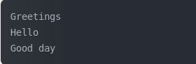

# GO ROUTINES 


## Intro

Goroutines : subroutine functions that can't be interrupted
- They have multiple points for supsension/re-entry.
- Go runtime observes their runtime behavior and automatically suspends them when they block and then resumes them when they become unblocked.
- Go follows a model of concurrency called "fork-join model" :
    - "fork" : at any point in the program it can split off a branch if execution to be run concurrently whith its parent. 
    - "join" : at some point in the future the conccurent branhces of execution we'll join back together a the "joint point".

    


## First example 

We can write go routines different ways :

```go
    func main(){
        go SayHello()
        //rest of the code ...
    } 

    func SayHello(){
        fmt.Println("Hello")
    }
```

or by using an anonymous function :

```go
    func main(){
        go func(){
            fmt.Println("Hello")
        }()
        // rest of the code ...
    }
```

or we can assign the function to a variable and call the anonymous function this way :

```go
    sayHello := func(){
        fmt.println("Hello")
    }
    go SayHello()
    // rest of the code ...
```

In this example SayHello()'ll be run on its own goroutine while the rest of the program continues executing.
Here, there's no joint point so the SayHello goroutine'll simply exit at some point in the future and the rest of the program'll have already continued executing :
- It's undertermined wether SayHello()'ll ever be run at all.
- The goroutine'll be created and scheduled with Go's runtime to execute but it may not get a chance to run before the main goroutine exits.
- In this case the programm'll finish executing before the goroutine hosting the call to SayHello ever started. 
- We could out a time.Sleep after the goroutine but it doesn't create a join point (only a race condition).


### Creating a join point

We need to synchronize the main and the SayHello goroutines : "synch.WaitGroup"

```go
    var wg synch.WaitGroup
    SayHello := func (){
        defer wg.Done()
        fmt.Println("Hello")
    }
    wg.Add(1)
    go SayHello()
    wg.Wait() //this is the join point 
```

    - The gorouitne is blocked until the goroutine hosting SayHello() terminates.

Closures close around the lexical scope they're created in (capturing variables)
- If we run a closure in a goroutine does the closure operate on a copy of these variables ? or the original reference ?

```go
    var wg synch.WaitGroup
    salutation := "hello"
    wg.Add(1)
    go func(){
        defer wg.Done()
        salutation = "Welcome"
    }()
    wg.Wait()
    fmt.Println(salutation)
```

    - Goroutines execute within the same address space they were created in so our program prints "Welcome".

```go
    var wg synch.WaitGroup
    for _, salutation := range []string {"Hello", "Greetings", "Good day"}{
        wd.Add(1)
        go func(){
            defer wg.Done()
            fmt.Println(salutation)
        }()
    }
    wg.Wait()
```

    - Before the 22 version Go update the result was :
    
        - Each iteration of the loop used the same variable which was updated in each iteration.
        - This led to unexpected behavior in goroutines : they might all end up referring to the final value of the loop variable.
    - After the update the result is :
    
        - Each iteration of a for loop that declares variables uses a new variable for each iteration.
        - This new behavior applies to "for", "for range" and "if" statement assignment loops.
        - This change makes the following code behave as most developers would intuitively expect:
        
```go
            for _, salutation := range []string{"Hello", "Greetings", "Good day"}{
                go func(){
                    fmt.Println(salutation)
                }()
            }
```

            - Now each goroutine captures a different "salutation" value corresponding to the iteration in which it was launched.
            - While this change makes many concurrent patterns in Go safer and more intuitive it's still considered to explicitly pass loop variables to goroutines
            - It makes the intent clear and ensures cimpatibility with older Go versions


```go
                for _, salutation := range []string {"Hello", "Greetings", "Good day"}{
                    go func(s string){
                        fmt.Println(s)
                    }(salutation)
                }
 ``` 
 
Because goroutines operate whithin the same address space as each other and just host functions : utilizing them is a natural extension to writing non-concurrent code.
Go compiler takes care of pinning variables in memory so that the goroutines don't accidently access freed memory :
- Allows developers to focus on their space problems instead of memory managment. 
- Since multiple goroutines can operate against the same address space we still need to worry about synchronization.
    - Synchronize access to the shared memory the goroutines access.
    - Use CSP primitives (Communicating Sequencial Processes) to share memory by communication.
        - Formal language for describing patterns of interaction in concurrent systems : components communicate with each other only through message passing whithout sharing memory.
Another benefit of goroutines : extraordinary lightweight (a few Kb/goroutine).

Goroutines are not garbage collected with the runtime"s ability to introspect upon itself and measure the amount of memory allocated before and after goroutine creation :

```go
func main(){
    memConsumed := func() unint64{
        runtime.GC()
        var s runtime.Memstats
        runtime.ReadMemStats(&s)
        return s.Sys
    }

    var c <-chan interface{}
    var wg synch.WaitGroup
    noop := func() {wg.Done(); <-c}

    cins numGoroutines = 1e4
    wg.Add(numGoroutines)
    before := memConsumed()
    for i := numGoroutines; i > 0; i --{
        go noop()
    }
    wg.Wait()
    after := memConsumed()
    fmt.Printf("%.3fkb", float64(after-before)/numGoroutines/1000)
}
```

- We require goroutines that'll never exit so we can keep them in memory for measurement.
- We define the number of goroutines to create (1e4 = 10 000).
- We measure the amount of memory consumed before and after creating our goroutines.
- The result we get is arround 2.600kb


## Sync package 

Contains the concurrency primitives that are most useful for lowlevel memory access synchronization.

### WaitGroup

WaitGroup is a great way to wait for a set of conccurent operations to complete when :
- We don't care about the result of the concurrent operations.
- We have other means to collect their result. 
    - If not : We'd better use Channels and select a statement.

Basic example of using WaitGroup to wait for goroutines to complete :

```go
    func main(){
        var wg sync.WaitGroup 

        wg.Add(1)
        go func(){
            defer wg.Done()
            fmt.Println("1st goroutine sleeping...")
            time.Sleep(1)
        }()

        wg.Add(1)
        go func() {
            defer wg.Done()
            fmt.Prinln("2cd goroutine sleeping...")
            time.Sleep(2)
        }()
        wg.wait()
        fmt.Println("All goroutines complete.")
    }
```

- We call Add with an argument of 1 to indicate that one goroutine is beginning.
- We call Done using the defer keyword to ensure that before we exit the goroutine's closure we indicate to the WaitGroup that we've exited.
- We call Wait which blocks the main goroutine until all goroutines have indicated they have exited. 
- We get this result :


- Go'll send you 2 error messages saying that sleeping for 1 nanoseconds is probably a bug because most operating systems don't provide precise timing down to the nanosecond level (the typical time is in the range of microseconds or milliseconds).
    - 1 nanosecond sleep'll almost expire immediatly and may not give the goroutine scheduler enough time to switch contexts.

We can think of WaitGroup like a concurrent-safe counter : 
- Calls to Add to increment the counter by the integer passed in.
- Calls Done to decrement the counter by 1.
- Calls Wait to block until the counter attains 0.

It's customary to couple calls to Add as closely as possible to the goroutines they're helping to track but sometimes we'll find Add called to track a group of goroutines all at once:

```go
func main(){
    hello := func(wg *sync.WaitGroup, id int) {
	    defer wg.Done()
	    fmt.Printf("Hello from %v\n", id)
    }
	const numGreeeters = 5
	wg.Add(numGreeeters)
	for i := 0; i < numGreeeters; i++ {
		go hello(&wg, i+1)
	}
	wg.Wait()
}
```
- We'll get this result :


- But if we run it several times we won't get the same order because it's the principle of concurrency :
- Go's runtime scheduler decides when to execute each goroutine based on factors like CPU availability, the state of the other goroutines and the internal scheduling algorithm.
- There's no garuantee that the goroutines'll execute in the order they were created.


### Mutex & RWMutex


#### Mutex

Mutex : Mutual Exclusion, it's a way to guard critical sections of our program (areas that require exclusive acces to a sharde resource).
- Provides a conccurent-safe way to express exclusive acces to these sharred resources.
- Shares memory by creating a convention developers have to follow to synchronyze access to the memory.
- We're responsible for coordinationg access to this memory by guarding access to it with a Mutex.

Example of 2 goroutines attempting to increment & decrement a common value, they use Mutex to synchronize access :

```go
    func main(){
        var count int 
        var lock sync.Mutex

        increment := func(){
            lock.Lock()
            defer lock.Unlock()
            count ++
            fmt.Printf("Incrementing: %d\n", count)
        }

        decrement := func(){
            lock.Lock()
            defer lock.Unlock()
            count --
            fmt.Printf("Decrementing: %d\n", count)
        }

        var arithmectic sync.WaitGroup
        for i := 0; i <= 5; i ++{
            arithmetic.Add(1)
            go func(){
                defer arithmetic.Done()
                increment()
            }()
        }

        for i := 0; i <= 5; i --{
            arithmetic.Add(1)
            go func(){
                defer arithmetic.Done()
                decrement()
            }()
        }
        arithmetic.Wait()
        fmt.Println("Arithmetic complete.")
    }
```

we could refactor the for loop :

``` go
    func main(){
        var count int
        var lock sync.Mutex
        var arithmetic sync.WaitGroup

        increment := func(){
            lock.Lock()
            defer lock.Unlock()
            count++
            fmt.Printf("Incrementing: %d\n", count)
        }

        decrement := func(){
            lock.Lock()
            defer lock.Unlock()
            count --
            fmt.Printf("Decrementing: %d\n", count)
        }

        for i := 0; i <= 5; i ++{
            arithmetic.Add(1)
            go func(){
                defer arithmetic.Done()
                increment()
            }()
            arithmetic.Add(1)
            go func(){
                defer arithmetic.Done()
                decrement()
            }()
        }
        arithmetic.Wait()
        fmt.Println("Arithmetic complete.")
    }
```
- We request exclusive use of the critical section (the count variable) guarded by a Mutex lock : lock.Lock()
- We indicate that we're done with the critical section lock is guarding : defer lock.Unlock()
    - We always call Unlock whithin the defer statement : ensures that the call always happen even when panicking.
    - Failing to do so would probably cause our program to deadlock.
    - Deadlock : when >= 2 processes are each waiting for the other to release resources or perform actions, causing all of them to remain blocked indefinitly. 
- We get this kind of result (because it varies each time we run the program) :


#### RWMutex 

RWMutex : conceptually the same thing as Mutex, guards access to memory but gives us a little bit more control over the memory.
We can request a lock for reading : we'll be granted access unless the lock is beeing held for writing.
- An arbitrary number of readers can hold a reader lock so long as nothing else is holding a writer lock.

Example showing that a producer is less active than the numerous consumers the code creates :

```go
    func main(){
        var wg sync.WaitGroup

        producer := func(wg *sync.WaitGroup, l sync.Locker){
            defer wg.Done()
            for i:= 5; i > 0; i --{
                l.Lock()
                l.Unlock()
                time.Sleep(1)
            }
        }

        observer := func(wg *sync.WaitGroup, l sync.Locker){
            defer wg.Done()
            l.Lock()
            defer l.Unlock()
        }

        test := func(count int, mutex, rwMutex sync.Locker) time.Duration{
            wg.Add(count+1)
            beginTestTime := time.Now()
            go producer(&wg, Mutex)
            for i := count; i > 0; i --{
                go observer(&wg, rwMutex)
            } 
            wg.Wait()
            return time.Since(beginTestTime)
        }
        
        tw := tabwriter.NewWriter(os.Stdout, 0, 1, 2, ' ', 0)
        defer tw.Flush()

        var m sync.RWMutex 
        fmt.Fprintf(tw, "Readers\tRWMutex\tMutex\n")
        for i := 0; i < 20; i++{
            count := int(math.Pow(2, float64(i)))
            fmt.Fprintf(
                tw,
                "%d\t%v\t%v\n",
                count,
                test(count, &m, m.RLocker()),
                test(count, &m, &m),
            )
        }
    }
```

- The producer function's 2cd parameter is of the type sync.Locker: has 2 methods (Lock and Unlock) that Mutex & RWMutex satisfy.
- We make the producer sleep for 1 nanosecond to make it less active than the observers goroutines.
- We get this result :


- What we need to remember is that :
    - RWMutex provides better performances read-heavy scenarios : allows multiple readers to acces the shared resource simultaneously, reducing contention.
    - Mutex is simpler and slightly faster in low-contention cases.


### Cond

Cond describes a "rendez-vous point for goroutines waiting for/announcing the occurence of an event".
- Event : any arbitrary signal between >=2 goroutines that carries no information other than the fact that it has occured.
- In most cases we'll want to wait for these signals before continuing execution on a goroutine.
whithout the Cond type : one naïve way of doing that is to use an infinite loop :

```go
    for conditionTrue() == false {

    }
```

- This would consume all cylces of one core : to fix that we'd need to use time.Sleep :

```go
    for conditionTrue() == false {
        time.Sleep(1*time.Millisecond)
    }
```

- This is better but still inefficient, we'd have to figure out how long to sleep for:
    - Too long : artificially degrading performances
    - Too short : unnecessary consuming too much CPU time
- It'd be better if the goroutine could efficiently sleep until it was signaled to wake and check its conditions : that's what Cond does for us

```go
    func main(){    
        c := sync.NewCond(&sync.Mutex)
        c.L.Lock()
        for conditionTrue() == false {
            c.Wait()
        }
        c.L.Unlock()
    }
```

- We initiate a new Cond that takes in a type that satsfy the sync.Locker interface (Mutex).
    - Allows the Cond type to facilite coordination with other goroutines in a concurrent-safe way.
- We lock the Locker for this condition : necessary because the call to Wait automatically calls Unlock on the Locker when entered.
- We wait to be notified that the condition has occured : blocking call (the goroutine'll be suspended).
- We unlock the Locker for this condition : necessary because when the call to Wait exits it calls Lock on the Locker for the condition.


#### Signal

Example to show both sides of the equation:
- A goroutine that's waiting for a signal 
- A goroutine that's sending the signal
We have a queue of fixed length 2 & 10 items we want to push onto the queue
- We want to enqueue items as soon as ther is a room : we want to be notified as soon as ther's room in the queue.

```go
    func main(){
        a := sync.NewCond(&sync.Mutex{})
        queue := make([]interface{}, 0, 10)

        removeFromQueue := func(delay time.Duration) {
            time.Sleep(delay)
            a.L.Lock()
            queue = queue[1:]
            fmt.Println("Removed from queue")
            a.L.Unlock()
            a.Signal()
        }

        for i := 0; i < 10; i++ {
            a.L.Lock()
            for len(queue) == 2 {
                a.Wait()
            }
            fmt.Println("Adding to queue")
            queue = append(queue, struct{}{})
            go removeFromQueue(1 * time.Second)
            a.L.Unlock()
        }
    }
```

- We create our condition using a standard sync.Mutex as the Locker.
- We create a slice with a length of 0 and initiate it with a capacity of 10.
- We enter the critical section for the condition by calling Lock on the condition's Locker.
- We check the length of the queue in a loop : 
    - important because a signal on the condition doesn't necessarily mean that what we've been waiting for has occurred only that something's occurred. 
- We call Wait : will suspend the main goroutine until a signal on the condition's been sent.
- We create a new goroutine that'll dequeue an element after 1 second.
- We exit the condition's critical section since we've successfully enqueued an item.
- We enter the critical section once again for the condition so we can modify data pertninent to the condition.
- We simulate dequeuing an item by reassigning the head of the slice to the 2cd item.
- We exit the condition's critical section since we've successfully dequeued an item.
- We let a goroutine wainting on the condition know that somethinf has occurred. 
- We get this result :


- The program successfully add 10 items to the queue and exits before it has a chance to dequeue the last 2 items 
- It always wait until at least 1 item is dequeued before enqueing another one.
- Signal : 1 of the 2 methods that Cond provides for notifying goroutines blocked on Wait call that condtion has been triggered (The other one is Broadcast).Internally the runtimes maintains a FIFO list of goroutines waiting to be signaled.
    - Signal finds the goroutine that's been waiting the longest and notifies that 
- Broadcast : sends a signal to all goroutines that are waiting 
    - Broadcast is more interesting as it provides a way to communicate with multiple goroutines at once.
    - We could do the same thing with Signal with channels but Broadcast is way more efficient.


    #### Broadcast 

    Lets imagine we're creating a GUI application with a button on it, we want to register an arbitrary number of functions that'll run when that button is clicked on. Con is perfect for it because we can use its Broadcast method to notify all registered handlers :

    ```go
        func main(){
            type Button struct {
                Clicked *sync.Cond
            }
            button := Button{Clicked: sync.NewCond(&sync.Mutex{})}

            subscribe := func(d *sync.Cond, fn func()){
                var goroutineRunning sync.WaitGroup
                goroutineRunning.Add(1)
                go func(){
                    goroutineRunning.Done()
                    d.L.Lock()
                    defer d.L.Unlock()
                    d.Wait()
                    fn()
                }()
                goroutineRunning.Wait()
            }

            var clickRegistered sync.WaitGroup
            clickRegistered.Add(3)
            subscribe(button.Clicked, func(){
                fmt.Println("Maximizing window")
                clickRegistered.Done()
            })
            subscribe(button.Clcked, func(){
                fmt.Println("Displaying annoying dialog box")
                clickRegistered.Done()
            })
            subscribe(button.Click, func(){
                fmt.Println("Mouse clicked")
                clickRegistered.Done()
            })
            button.Clicked.Broadcast()
            clickRegistered.Wait()
        }
    ```

- We define a type Button that contains the Condition Clicked.
- We define a convenience function that'll allow us to register functions to handle signals from a condition. 
    - Each handler is run on its own goroutine.
    - Subscribe'll not exit until that goroutine is confirmed to be running.
- We set a handler for when the mouse button is raised.
    - In turn it calls Broadcast on the Clicked Cond to let all handlers know that the mouse button has been clicked.
- We create WaitGroup to ensure our program doesn't exit before our writes to Stdout occur.
- We register a handler that simulates maximizing the button's window when the button is clicked.
- We register a handler that simulates displaying a dialog box when the mouse is clicked .
- We simulate a user raising the mouse button from having having clicked the application's button.
- We get this result :


- With 1 call to broadcast on the Clicked Cond all 3 handlers are run.
    - Without the clickRegistered WaitGroup we could call button.Clicked.Broadcast multiple times and each time all 3 handlers would be invoked.
    - This is something channel's can't do easily and one of the main reasons to use Cond type.
- Like most of the things in the sync Package the usage of Cond works best when constrained to a tight scope or exposed to a broader scope taht encapsulates it.
